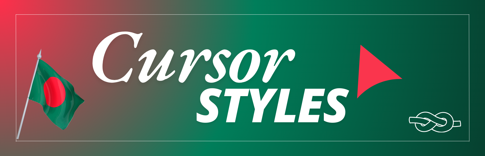

# CursorStyles


A simple npm package for React that offers smooth, customizable cursors.



 

## Installation

You can install `cursor-styles` using npm:

```bash
npm install cursor-styles
```

## Cursor Styles

As `cursor-styles` expands, you can easily switch between different cursor styles. The current options are:

| Cursor Style    | Import Code                                        | Demo Button                                                       |
| --------------- | -------------------------------------------------- | ----------------------------------------------------------------- |
| SimpleCursor    | `import { SimpleCursor } from "cursor-styles";`    | [View Demo](./src/Components/SimpleCursor/SimpleCursor.gif)       |
| FluidCursor     | `import { FluidCursor } from "cursor-styles";`     | [View Demo](./src/Components/FluidCursor/FluidCursor.gif)         |
| PieCursor       | `import { PieCursor } from "cursor-styles";`       | [View Demo](./src/Components/PieCursor/PieCursor.gif)             |
| ElasticCursor   | `import { ElasticCursor } from "cursor-styles";`   | [View Demo](./src/Components/ElasticCursor/ELasticCursor.gif)     |
| DonutCursor     | `import { DonutCursor } from "cursor-styles";`     | [View Demo](./src/Components/DonutCursor/donutCursor.gif)         |
| CustomPngCursor | `import { CustomPngCursor } from "cursor-styles";` | [View Demo](./src/Components/CustomPngCursor/CustomPngCursor.gif) |

### Basic Usage

To use the cursors from the library, follow these steps:

1. **Import the Component**: In your main file (e.g., `App.js` or `index.js`), add the following imports:

```javascript
import { SimpleCursor } from "cursor-styles"; // or FluidCursor
import "cursor-styles/dist/style.css";
```

2. **Add the Cursor Component**: Place the desired cursor component in your render method:

```javascript
<SimpleCursor />
// or
<FluidCursor />
```

### Customization

You can customize the cursor's appearance using the following attributes:

| Attribute           | Description                                                                          | Default Value                                        |
| ------------------- | ------------------------------------------------------------------------------------ | ---------------------------------------------------- |
| `size`              | Set the size of the cursor                                                           | `30`                                                 |
| `color`             | Change the cursor color                                                              | `black`                                              |
| `opacity`           | Adjust the cursor's opacity                                                          | `1`                                                  |
| `border`            | Set the cursor's border using CSS syntax                                             | `none`                                               |
| `TransitionTime`    | Set the cursor's transition time using number values in seconds                      | `0.2`                                                |
| `InnerBorderColor`  | Set the color (its for only pie cursor)                                              | `black`                                              |
| `Icon`              | pass the icon url or location path for `CustomPngCursor` (only for CustomPngCursor ) | `"https://i.ibb.co.com/ts3cf3j/Untitled-design.png"` |
| `hideDefaultCursor` | Set `true` to hide default cursor or `false` to show default cursor                  | `true`                                               |

### Example

Here’s an example of how to use the SimpleCursor with a custom styling:

```javascript
import React from "react";
import { SimpleCursor } from "cursor-styles";
import "cursor-styles/dist/style.css";

const App = () => {
  return (
    <div>
      <SimpleCursor
        size={30} ~*control the cursor overall size*~
        color="red" ~*control or change the bg-color of the cursor*~
        opacity={0.5} ~*control the opacity of the cursor keep value from (0-1)*~
        border="1px dotted blue" ~*border styling and adding*~
        TransitionTime={0.5} ~*control the transition time of cursor overall animation*~
        hideDefaultCursor={false} ~*false means the default cursor will show*~
      />
      {/* Your other components */}
    </div>
  );
};

export default App;
```

## Changing Cursor Types

To change the cursor type in the future, simply import the desired cursor component:

```javascript
import { [NewCursorStyle] } from "cursor-styles";
```

Then use it in your component:

```javascript
<NewCursorStyle
  size={30}
  color="red"
  opacity={1}
  border="1px solid green"
  TransitionTime={0.5}
  hideDefaultCursor={false}
/>
```

### Example of Changing Type

For instance, if a new cursor Type called `SparkleCursor` is added:

```javascript
import { SparkleCursor } from "cursor-styles";

const App = () => {
  return (
    <div>
      <SparkleCursor
        size={30}
        color="red"
        opacity={1}
        border="1px solid green"
        TransitionTime={0.5}
        hideDefaultCursor={false}
      />
      {/* Your other components */}
    </div>
  );
};
```

## Conclusion

`cursor-styles` provides an easy way to implement customizable cursors in your React applications. Enjoy smooth, interactive cursors that enhance user experience!

## Contributions

If you want to contribute to this project, fork the [repository](https://github.com/arafatrahat94/cursor-styles) and clone it to your local machine. Commit your changes and push your changes to your forked repository. Finally, open a pull request with a detailed description of your changes to the dev branch.I highly appreciate any contributions.

## Issues

If you are facing any problem, feel free to share [here](https://github.com/arafatrahat94/cursor-styles/issues).

## Changelog

```markdown
### [1.0.2] - 2024-11-20

- First Stable Release.

### [Unreleased]

- Features and improvements are being developed.
```

This version starts with the most recent changes and works backward to the initial release. Let me know if you need further adjustments!

## Contact Me

❒ [Gmail](mailto:arafatrahat94@gmail.com) <br>
❒ [WhatsApp](https://wa.me/+8801980389400) <br>
❒ [Linkedin](https://www.linkedin.com/in/MdArafathHossain)<br>
❒ [FaceBook](https://www.facebook.com/md.arafathhossainrahat)<br>
❒ [Telegram](https://t.me/ArafathSensei94)

## Todo

- ~~Add method to control transition time.~~
- ~~Add Pie cursor style.~~
- ~~Add attribute to hide default cursor.~~
- Add magic color effect on cursor move.
- Add click style effect on cursor click.
- ~~Add Emoji cursor style-> use CustomPngCursor and pass emoji~~
- Add Fire cursor style.
- ~~Add Custom cursor style.~~
- ~~Add Elastic cursor style.~~
- Add click effect for Elastic cursor style.
- Add Bubble effect while cursor moving.
- Add Neon cursor style.
- Add Ripple effect cursor moving.
- Add Snake effect cursor moving.
- ~~Add Donut Cursor Style.~~
- Add click event scale up and opacity reduce

## License

This project is licensed under the Apache 2.0 License. See the [LICENSE](LICENSE) file for more details.


---
